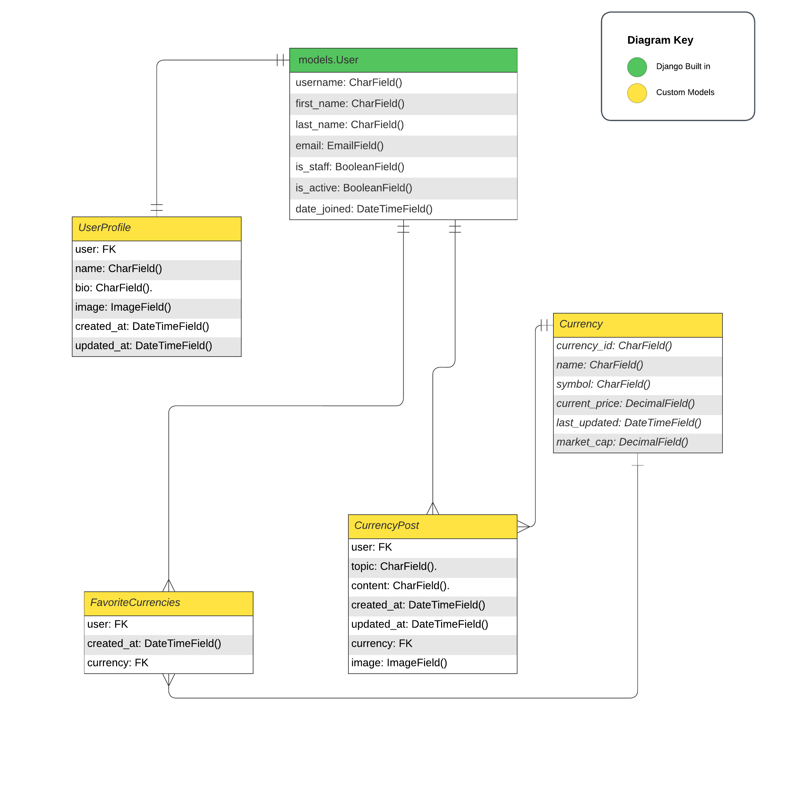

# **BlockBoard Crypto Tracker Backend API**

💻 [Live link](https://crypto-tracker-heroku-b5acda38c706.herokuapp.com/)

Welcome to the backend of BlockBoard Crypto Tracker, a dynamic and robust web application designed to provide insights and analysis for cryptocurrency enthusiasts. This backend serves as the powerhouse of the application, handling data management, user authentication, and seamless integration with Coinmarketcap's cryptocurrency APIs.

Built using Django and Django REST framework, the backend infrastructure offers a secure, scalable, and efficient solution to manage vast amounts of data related to cryptocurrencies. The system is engineered to cater to both novice users and seasoned traders, providing them with up-to-date information and an interactive platform to track their favorite digital currencies.

This was my 5th and last learning project as part of Code Institutes course in Full Stack Software Development.

## Table of Contents

- [Project Structure](#project-structure)
  - [Code Structure](#code-structure)
- [User Stories](#user-stories)
  - [Base Setup](#base-setup)
  - [Registration and Authentication](#registration-and-authentication)
  - [Landing Page Display](#landing-page-display)
  - [Cryptocurrency Details](#cryptocurrency-details)
  - [User Preferences](#user-preferences)
  - [Community Engagement](#community-engagement)
  - [User Profile Management](#user-profile-management)
- [Technologies Used](#technologies-used)
- [Agile Design](#agile-design)
- [Database Design](#database-design)
  - [Models](#models)
- [Features](#features)
- [Validation](#validation)
- [Testing](#testing)
- [Deployment](#deployment)
- [Bugs](#bugs)
- [Credits](#credits)
- [Thank You](#thank-you)

## Project Structure

The overall structure of the project was designed to effectively represent a cryptocurrency tracking application, utilizing Django and Django REST Framework to handle backend functionalities including models, views, serializers, and URLs.

### Code Structure

The project code structure is meticulously organized and divided into various application folders, constructed using Django Rest Framework for efficient management and scalability.

#### Project Apps

- **UserProfile App**: Manages user profiles, including model, views, serializers, tests, and URLs.
- **Currency App**: Handles cryptocurrencies, their data fetching, and representation.
- **CurrencyPost App**: Manages posts related to different cryptocurrencies.
- **FavouriteCurrencies App**: Allows users to mark their favourite currencies.

#### Django Specifics

- **settings.py**: Contains configuration settings of the Django project, including database settings, installed apps, and middleware.
- **urls.py**: Defines the URL routes for different apps and functionalities.
- **models.py**: Contains database models for various apps, defining data structure.
- **views.py**: Manages the logic and control flow for requests and responses.
- **serializers.py**: Handles the conversion of complex data types, such as querysets and model instances, to native Python datatypes.
- **tests.py**: Handles the tests made for each app.

## User Stories

### Base Setup

1. **User Story ID: 1.1**: As a backend developer, I need a consistent API structure to ensure seamless integration with the frontend.
2. **User Story ID: 1.2**: Establishment of a scalable and efficient database structure for storing and retrieving static resources like images and user data.
3. **User Story ID: 1.3**: Implementation of REST endpoints for navigation-related data to facilitate easy site navigation in the frontend.

### Registration and Authentication

5. **User Story ID: 2.1**: As a backend developer, I need to implement user sign-up functionality to allow new visitors to create accounts.
6. **User Story ID: 2.2**: Development of user login functionality to authenticate returning users.
7. **User Story ID: 2.3**: API endpoint to verify and display the authenticated user’s information on the frontend after login.

### Cryptocurrency Data Management

8. **User Story ID: 3.1**: Development of an API endpoint to display top cryptocurrencies, ensuring data is up-to-date and accurate.
9. **User Story ID: 3.2**: Implementation of a 'read more' API feature to provide additional information about various cryptocurrencies.
10. **User Story ID: 3.3**: Backend functionality to manage and display additional informative content related to cryptocurrencies.

### Cryptocurrency Details

11. **User Story ID: 4.1**: Development of detailed API endpoints for each cryptocurrency to provide extensive data, including historical trends, market caps, and more.

### User Preferences

12. **User Story ID: 5.1**: Implementation of a 'like' feature in the backend to allow users to personalize their experience by favoriting cryptocurrencies.
13. **User Story ID: 5.2**: Backend functionality for un-like feature to enable users to remove cryptocurrencies from their favorites.

### Community Engagement

14. **User Story ID: 6.1**: Creation of API endpoints for posting comments on cryptocurrency-related content for registered users.
15. **User Story ID: 6.2**: Implementing read functionalities for comments so all users can view community insights.
16. **User Story ID: 6.3**: Backend support for users to edit their own comments.
17. **User Story ID: 6.4**: API functionality for users to delete their comments.

### User Profile Management

19. **User Story ID: 7.1**: Development of API endpoints for users to update their profile details, including name, bio, and profile picture.
20. **User Story ID: 7.2**: Backend implementation for a personalized user dashboard displaying liked cryptocurrencies and their price development.

## Technologies Used

### Languages & Frameworks

- Python 3.10.2
- Django
- Django REST Framework

### Libraries & Tools

- [Cloudinary](https://cloudinary.com/) to store images for profile and events
- [CI Python Linter](https://pep8ci.herokuapp.com/) was used for validation of python files.
- [Lucidcharts](https://lucid.app/) has been used in project to design and document data model architecture.
- [VsCode](https://code.visualstudio.com) was IDE used for writing code and to push the code to GitHub
- [GitHub](https://github.com/) was used as a remote repository to store project code
- [Heroku](https://heroku.com) - Cloud platform. Justification: I used this was used to deploy the project into live environment
- [Django REST Framework](https://www.django-rest-framework.org/) - API toolkit. Justification: I used this to build the back-end API
- [Django AllAuth](https://django-allauth.readthedocs.io/en/latest/index.html) - API Module. Justification: I used this for user authentication
- [Psycopg2](https://www.psycopg.org/docs/) - PostgreSQL database adaptor. Justification: This was used as a PostgreSQL database adapter for Python
- [ElephantSQL](https://www.elephantsql.com/) - Database hosting service – Justification: This was used as the deployed project on Heroku uses an ElephantSQL database

- Various other Python libraries as listed in `requirements.txt`.

All libraries

## Agile Design

### About Agile Methodology

- The project followed Agile methodologies for its development lifecycle, including iterative development, continuous feedback, and adaptive planning.

### User Story Implementation

- User stories were created and prioritized based on the MOSCOW method (Must Have, Should Have, Could Have, Won't Have).
- Agile tools like GitHub Projects were used to track the progress of user stories and tasks.

## Database Design

The end result of the design of the databases was tweaked along the way and looks somewhat different from the original design.

The first diagram can be seen here

Model Diagram:

 

 

### Current Database Models

#### Currency Model

- Manages cryptocurrency data including price, market cap, and more.

| Name          | Database Key  | Field Type | Validation            |
| ------------- | ------------- | ---------- | --------------------- |
| currency_id   | currency_id   | CharField  | max_length=255        |
| name          | name          | CharField  | max_length=255        |
| symbol        | symbol        | CharField  | max_length=255        |
| current_price | current_price | FloatField |                       |
| market_cap    | market_cap    | FloatField |                       |
| total_volume  | total_volume  | FloatField |                       |
| logo_url      | logo_url      | URLField   | blank=True, null=True |
| description   | description   | TextField  | blank=True, null=True |

#### CurrencyPost Model

- Manages posts related to cryptocurrencies.

| Name       | Database Key | Field Type    | Validation                                                 |
| ---------- | ------------ | ------------- | ---------------------------------------------------------- |
| user       | user         | ForeignKey    | User, on_delete=models.CASCADE                             |
| topic      | topic        | CharField     | max_length=255                                             |
| content    | content      | TextField     |                                                            |
| created_at | created_at   | DateTimeField | auto_now_add=True                                          |
| updated_at | updated_at   | DateTimeField | auto_now=True                                              |
| currency   | currency     | ForeignKey    | Currency, on_delete=models.SET_NULL, null=True, blank=True |
| image      | image        | ImageField    | upload_to='images/', blank=True                            |

#### FavouriteCurrencies Model

- Manages user's favourite cryptocurrencies.

| Name       | Database Key | Field Type    | Validation                                                   |
| ---------- | ------------ | ------------- | ------------------------------------------------------------ |
| user       | user         | ForeignKey    | User, on_delete=models.CASCADE                               |
| currency   | currency     | ForeignKey    | Currency, related_name='favourite', on_delete=models.CASCADE |
| created_at | created_at   | DateTimeField | auto_now_add=True                                            |

#### UserProfile Model

- Manages user profiles.

| Name       | Database Key | Field Type    | Validation                                                 |
| ---------- | ------------ | ------------- | ---------------------------------------------------------- |
| user       | user         | OneToOneField | User, on_delete=models.CASCADE, related_name='userprofile' |
| name       | name         | CharField     | max_length=255, blank=True                                 |
| bio        | bio          | TextField     | blank=True                                                 |
| image      | image        | ImageField    | upload_to='images/', default='../profile_znyvhv.jpg'       |
| created_at | created_at   | DateTimeField | auto_now_add=True                                          |
| updated_at | updated_at   | DateTimeField | auto_now=True                                              |

### Features

#### Implemented Features

- User authentication and profile management.
- Display and management of cryptocurrencies.
- User's ability to like or dislike cryptocurrencies.
- Community engagement through posting and managing comments on cryptocurrencies.
- Admin features for managing user comments and posts.

#### Future Features

- Advanced filtering and sorting of cryptocurrencies.
- Real-time updates of cryptocurrency prices.
- Social sharing options for currency posts.
- More extensive chat and social features.

## Validation

### Python Code Validation

- PEP8 compliance was ensured for all Python files.
- [CI Python Linter](https://pep8ci.herokuapp.com/) was used for validation of python files.

All all models, views, serializers, urls, tests and admins tas taken through the CI linter. A few "line too long" warnings were discovered and corrected and after this Results returned clean.

## Testing

- Testing of the website can be [seen here](/TESTING.md/)

## Deployment

### Creating Database using ElephantSQL

1. To generate a managed PostgreSQL database, please proceed to [ElephantSQL](https://customer.elephantsql.com/) and either sign up or sign in to your account. Once you've logged in, click on the 'Create New Instance' button.

2. Name your database and select the 'Tiny Turtle' payment plan. Then, click on 'Select Region'

3. Select your preferred region and create the database instance.

- After creating the instance, navigate to the instances page and click on the name of the database you selected earlier. Then, in the details section on the following page, copy the PostgreSQL URL.

### Heroku Deployment

- The project was deployed to Heroku, a cloud platform as a service supporting several programming languages.
- The deployment process included setting up a Procfile, configuring environment variables, and deploying the codebase.
- Continuous deployment was set up to automatically deploy the main branch of the repository.

### Deploying the website in Heroku

- Before deploying in Heroku following files were created:
  1. env.py : stores confidential data eg. API keys, passwords etc.

2. Procfile : Very important for deployment and must be added with capital P

3. Requirements.txt: This must be updated for deployment in Heroku. It stores data of libraries used for project

- The website was deployed to Heroko using following steps:

#### Login or create an account at Heroku

- Make an account in Heroko and login

#### Creating an app

- Create new app in the top right of the screen and add an app name.
- Select region
- Then click "create app".

#### Open settings Tab

##### Click on config var

- Store CLOUDINARY_URL file from in key and add the values
- Store DATABASE_URL file from in key and add the values
- Store SECRET_KEY file from in key and add the values
- Store ALLOWED_HOST in key and add the value
- Store DISABLE_COLLECTSTATIC in key and add the value

##### Add Buildpacks

- Add python buildpack first
- Add Nodejs buildpack after that

#### Open Deploy Tab

##### Choose deployment method

- Connect GITHUB
- Login if prompted

##### Connect to Github

- Choose repositories you want to connect
- Click "Connect"

##### Automatic and Manual deploy

- Choose a method to deploy
- After Deploy is clicked it will install various file

##### Deployment

- Project was deployed in Heroku

### Forking the GitHub Repository

1. Go to the GitHub repository
2. Click on Fork button in top right corner
3. You will then have a copy of the repository in your own GitHub account.
4. [GitHub Repository](https://github.com/christiangoran/crypto-tracker-backend)

### Cloning the repository in GitHub

1. Visit the GitHub page of the website's repository
2. Click the “Clone” button on top of the page
3. Click on “HTTPS”
4. Click on the copy button next to the link to copy it
5. Open your IDE
6. Type `git clone <copied URL>` into the terminal

### Local Deployment

- Instructions for setting up the project locally include cloning the repository, installing dependencies, and setting up environment variables.

## Bugs

## Bugs & problems

- Hitting the 32kb limit on Heroku config vars

  - When trying to add a config var with the coinmarketcap API, I am unable to, and the most probable cause for it is that I have reached the 32kb limit that Heroku has on config vars.
    - Solution: There seem to have been a corrupted Heroku app, after deleting and creating a new app, I could add the necessary config vars

- After deploying to Heroku, my currency model was empty and I need to find out how to make my Heroku app call the Coinmarketcap API to populate my currency model.

  - I added the Heroku Scheduler service to my Heroku app and configured it to run "python3 manage.py update_currencies" every 10 minutes. Later changed it to update once a day, since I was running out of monthly API calls.

- When sending a request from my signup form, a new user was registered to the database, but somewhere in the execution order after the registration I get a 500 error response. After looking through Heroku logs and not finding anything but a 500 error. I added LOGGING to my Django settings.py.
  - Solution: After 4-5 hours of searching for what the error could be. What eventually appeared to be the problem was the use of useNavigate/useHistory and that the use of this changed with the latest version of React. So after changing the code snippet "history.push("/signin");" and "const history = useNavigate();" to "const navigate = useNavigate();" and "navigate("/signin")" I managed to finally make it work.

LOGGING = {
'version': 1,
'disable_existing_loggers': False,
'handlers': {
'console': {
'class': 'logging.StreamHandler',
},
},
'loggers': {
'django': {
'handlers': ['console'],
'level': 'DEBUG',
'propagate': True,
},
},
}

- The problem was then identified as being a missing Meta.model in my CurrentUserSerializer

- Having problems authenticating when sending requests from my frontend and I am not sure why my currentUser token is 'undefined'
  - All of this has been a cocktail of errors. The backend views.py for favouritecurrencies needed to be changed so only the specific authenticated user could retrieve his/her specific list of favourites. Then this array of favourites needed to be handled correcly in the frontend.
    (https://www.django-rest-framework.org/api-guide/permissions/)

## Credits

### Sources

The code was written with the help of Code Institute walkthrough project drf-api

https://stackoverflow.com/questions/69510138/how-to-get-data-from-external-api-to-django-rest-framework - for connecting external API to Rest

https://medium.com/@chilinski.a/how-to-seed-a-django-api-with-data-from-an-external-api-b577b6e6ad54 - connecting external API to Rest

https://www.youtube.com/watch?v=QA6oTpMZp84 - using Coingeckos API

https://www.datacamp.com/tutorial/making-http-requests-in-python - Making a http request in Python

https://docs.djangoproject.com/en/4.2/howto/custom-management-commands/ - custom management commands

https://www.youtube.com/watch?v=f3GfkvfpVAE - learning how to use coinmarketcaps api

https://coinmarketcap.com/api/documentation/v1/#section/Quick-Start-Guide - how to use their api

https://www.django-rest-framework.org/api-guide/permissions/ - Learning more about authentication

https://www.freecodecamp.org/news/format-compact-numbers-with-javascript/ - format large numbers

## Thank You

- Code Institute for providing a great course and support. 
- My mentor Gareth McGirr for great guidance and for wanting to help me more than expected of him with the problems encountered during the development of the project 
- Slack community for great involvement in helping each other 
