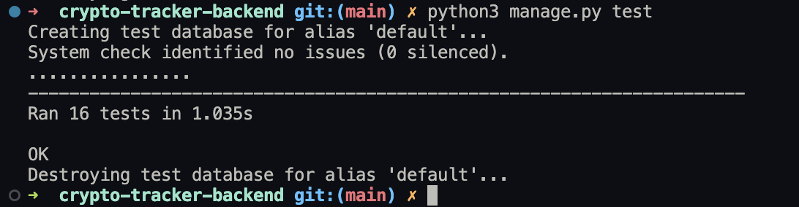

# TESTING

## Table of Contents

1. [Manual Testing](#manual-testing-of-user-stories)
2. [Automated Testing](#automated-testing)
3. [Bugs](#bugs)
4. [Unfixed Bugs](#unfixed-bugs)

### Manual Testing of User Stories

### Base Setup

#### User Story ID: 1.1

- **Objective**: Establish a consistent API structure.
  | **Step** | **Expected Result** | **Actual Result** |
  |----------|---------------------|-------------------|
  | Review API structure | Consistent structure across endpoints | Worked as expected |

#### User Story ID: 1.2

- **Objective**: Scalable database for static resources.
  | **Step** | **Expected Result** | **Actual Result** |
  |----------|---------------------|-------------------|
  | Test image and data storage | Efficient retrieval and storage | Worked as expected |

#### User Story ID: 1.3

- **Objective**: Implement navigation-related REST endpoints.
  | **Step** | **Expected Result** | **Actual Result** |
  |----------|---------------------|-------------------|
  | Test navigation endpoints | Easy and functional navigation | Worked as expected |

### Registration and Authentication

#### User Story ID: 2.1

- **Objective**: Implement user sign-up functionality.
  | **Step** | **Expected Result** | **Actual Result** |
  |----------|---------------------|-------------------|
  | Register a new user account | Successful account creation | Worked as expected |

#### User Story ID: 2.2

- **Objective**: Develop user login functionality.
  | **Step** | **Expected Result** | **Actual Result** |
  |----------|---------------------|-------------------|
  | User login | Successful authentication | Worked as expected |

#### User Story ID: 2.3

- **Objective**: Display authenticated user’s information.
  | **Step** | **Expected Result** | **Actual Result** |
  |----------|---------------------|-------------------|
  | Verify logged-in user information | Display user details | Worked as expected |

### Cryptocurrency Data Management

#### User Story ID: 3.1

- **Objective**: Display cryptocurrencies.
  | **Step** | **Expected Result** | **Actual Result** |
  |----------|---------------------|-------------------|
  | Access the API endpoint | Display cryptocurrencies | Worked as expected |

### User Preferences

#### User Story ID: 5.1

- **Objective**: Implement 'like' feature.
  | **Step** | **Expected Result** | **Actual Result** |
  |----------|---------------------|-------------------|
  | Click 'Like' on a cryptocurrency | Cryptocurrency added to favorites | Worked as expected |

#### User Story ID: 5.2

- **Objective**: Allow users to 'un-like' cryptocurrencies.
  | **Step** | **Expected Result** | **Actual Result** |
  |----------|---------------------|-------------------|
  | Click 'Un-like' on a favorited cryptocurrency | Cryptocurrency removed from favorites | Worked as expected |

### Community Engagement

#### User Story ID: 6.1

- **Objective**: Enable comment posting on cryptocurrency content.
  | **Step** | **Expected Result** | **Actual Result** |
  |----------|---------------------|-------------------|
  | Post a comment on a cryptocurrency page | Comment successfully posted | Worked as expected |

#### User Story ID: 6.2

- **Objective**: Allow reading of community comments.
  | **Step** | **Expected Result** | **Actual Result** |
  |----------|---------------------|-------------------|
  | View comments on a cryptocurrency page | Display all comments | Worked as expected |

#### User Story ID: 6.3

- **Objective**: Support comment editing.
  | **Step** | **Expected Result** | **Actual Result** |
  |----------|---------------------|-------------------|
  | Edit an existing comment | Comment updated successfully | Worked as expected |

#### User Story ID: 6.4

- **Objective**: Allow users to delete their comments.
  | **Step** | **Expected Result** | **Actual Result** |
  |----------|---------------------|-------------------|
  | Delete a user's own comment | Comment successfully deleted | Worked as expected |

### User Profile Management

#### User Story ID: 7.1

- **Objective**: Allow users to update their profile details.
  | **Step** | **Expected Result** | **Actual Result** |
  |----------|---------------------|-------------------|
  | Update profile details through the API | Profile details updated | Worked as expected |

#### User Story ID: 7.2

- **Objective**: Display a personalized dashboard.
  | **Step** | **Expected Result** | **Actual Result** |
  |----------|---------------------|-------------------|
  | Access user dashboard | Show liked cryptocurrencies and portfolio | Worked as expected |

## Automated Testing

- Automated tests were written using Django's `APITestCase`.
- The following areas were covered:
  - User authentication.
  - CRUD operations on cryptocurrency data.
  - Profile and user preference management.
- Used coverage reports to ensure a high percentage of codebase testing.

Test Results

### Key Areas of Testing

#### User Authentication Testing

- **LogoutRouteTest**: Validates that the logout route clears cookies, ensuring secure user logout.
- **CurrentUserSerializerTest**: Tests the serialization of current user data, verifying the presence of expected fields like username, email, and profile image.

#### CRUD Operations on Currency Post Data

- **CurrencyPostListViewTest**: Checks the retrieval of currency posts, ensuring the correct number and details are fetched.
- **CurrencyModelTest**: Validates the creation of currency models with attributes like current price and market cap.
- **FetchDataFromCoinMarketCapTest**: Tests the functionality of fetching data from CoinMarketCap, handling both successful and failed data retrieval.

#### Profile and User Preference Management

- **UserProfileAPITest**: Tests user profile retrieval and updates, ensuring correct data handling and response.
- **FavouriteCurrenciesModelTest**: Validates the creation of favorite currencies and the serializer's functionality, including unique constraint checks.

#### Permission and Access Control Testing

- **IsOwnerOrReadOnlyTest**: Tests custom permission class `IsOwnerOrReadOnly` to ensure that only owners can perform unsafe methods (POST, DELETE), while safe methods (GET) are accessible by any user.

### Test Implementation Examples

- **CurrencyPostModelTest**: Sets up a user, currency, and currency post, and validates the creation and attributes of the currency post.
- **CurrencyPostListViewTest**: Creates a currency post and uses an API request to validate the retrieval of currency posts.

## Bugs

#### During Development

- Encountered issues with data serialization in the cryptocurrency models, which were resolved by adjusting the serializer methods.
- Initially faced CORS issues, which were fixed by correctly setting up Django CORS headers.

#### Post-Deployment

- No critical bugs were found post-deployment. Minor issues were promptly resolved.

## Unfixed Bugs

- As of the latest update, there are no known unfixed bugs.

##### Back to [top](#table-of-contents)
